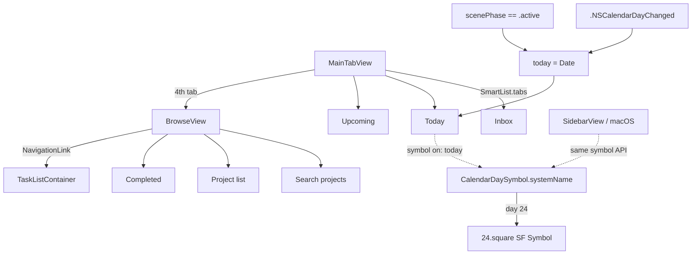

# 2026-07-24

## Session 1 — Todoist bottom bar (Inbox / Today / Upcoming / Browse)

Rework the iOS tab bar to match Todoist exactly: drop the Projects tab, land on the
canonical four, and render the current day-of-month inside the Today icon.

### System flow

### Affected components

- **iOS shell** — `MainTabView` (tab set + day-rollover refresh)
- **Features** — new `Browse` feature; `Navigation/SmartList`; `Projects/ProjectsListView` deleted
- **macOS shell** — `SidebarView` adopts the new symbol API and the same midnight refresh
- **Core** — new `CalendarDaySymbol` (pure, calendar-injectable)
- **Tests** — `CalendarDaySymbolTests` (5 cases)

### What was done

- [x] Removed the Projects tab; bottom bar is now Inbox / Today / Upcoming / Browse
- [x] Today icon renders the day number as a real SF Symbol (`<n>.square`)
- [x] Icon refreshes on `.NSCalendarDayChanged` and on foreground (`scenePhase == .active`)
- [x] `BrowseView` absorbs project browsing + project search + Completed
- [x] macOS sidebar kept in sync (same symbol API, same midnight refresh)
- [x] `swiftlint --quiet` clean; `xcodegen generate`; iOS build succeeded
- [x] Verified in the simulator: all four tabs render, Today shows `24`

### Key decisions

- **Day number is a genuine SF Symbol, not a composed overlay.** Custom views don't
  render inside `Tab`/`.tabItem` labels, so `"\(day).square"` is the only route to a
  native-looking numbered tab icon. SF Symbols covers `1.square`…`50.square`;
  availability was confirmed against `name_availability.plist`, not assumed.
- **Logic lives in `OpenFocusCore`, not the view.** The GUI sources aren't a SwiftPM
  target, so nothing there is unit-testable. `CalendarDaySymbol` takes an injectable
  `Calendar`, which makes the day-boundary behaviour testable off the app target and
  satisfies the repo's TDD policy.
- **`symbol` became `symbol(on:)`.** A stored/computed property can't take the date the
  Today icon depends on; making it a method forces every call site to be explicit about
  which day it's rendering.
- **`.onReceive` + Combine publisher over the async `notifications(named:)` sequence.**
  `SWIFT_STRICT_CONCURRENCY: complete` is set and `Notification` is non-Sendable.
- **Browse is not a task list.** It's the fourth tab in Todoist and holds everything that
  isn't a bottom-bar list — search, projects, Completed — so `SmartList.tabs` deliberately
  excludes `.completed`.
- **No custom tab-bar chrome.** `TabView` adopts the Liquid Glass bar on its own; the
  glass-restraint rule says don't hand-roll it.

### Files changed

| File | Change |
|---|---|
| `Sources/Core/Models/CalendarDaySymbol.swift` | new — day-of-month → SF Symbol, injectable `Calendar` |
| `Tests/UnitTests/CalendarDaySymbolTests.swift` | new — 5 swift-testing cases incl. rollover |
| `Sources/Features/Browse/BrowseView.swift` | new — fourth tab: search + projects + Completed |
| `Sources/Features/Navigation/SmartList.swift` | cases reordered to bar order; `static let tabs`; `symbol` → `symbol(on:)` |
| `Sources/Platform/iOS/MainTabView.swift` | rewritten — 4 tabs via iOS 26 `Tab` API, day-rollover refresh |
| `Sources/Platform/macOS/SidebarView.swift` | new symbol API + `.NSCalendarDayChanged` refresh |
| `Sources/Features/Projects/ProjectsListView.swift` | deleted — subsumed by `BrowseView` |

### Mistakes and fixes

- Unquoted `--include=*.swift` glob failed under zsh (`no matches found`); quoted it.
- Build emits three `appintentsmetadataprocessor … No AppIntents.framework dependency
  found` warnings. Pre-existing and unrelated to this change.

### Next steps

- Consider showing per-list counts (Todoist badges the Today tab).
- `BrowseView` search covers project names only; extend to tasks when search lands.
