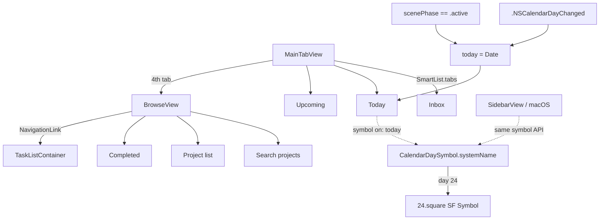
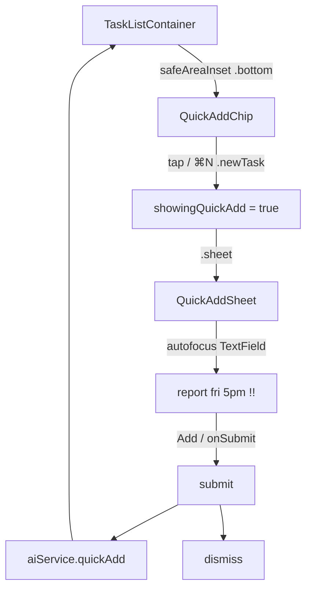
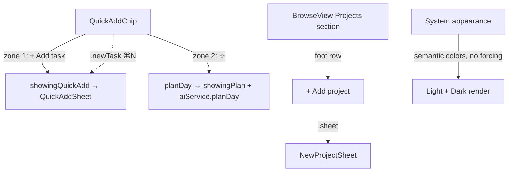

# 2026-07-24

## Session 1 — Todoist bottom bar (Inbox / Today / Upcoming / Browse)

Rework the iOS tab bar to match Todoist exactly: drop the Projects tab, land on the
canonical four, and render the current day-of-month inside the Today icon.

### System flow

### Affected components

- **iOS shell** — `MainTabView` (tab set + day-rollover refresh)
- **Features** — new `Browse` feature; `Navigation/SmartList`; `Projects/ProjectsListView` deleted
- **macOS shell** — `SidebarView` adopts the new symbol API and the same midnight refresh
- **Core** — new `CalendarDaySymbol` (pure, calendar-injectable)
- **Tests** — `CalendarDaySymbolTests` (5 cases)

### What was done

- [x] Removed the Projects tab; bottom bar is now Inbox / Today / Upcoming / Browse
- [x] Today icon renders the day number as a real SF Symbol (`<n>.square`)
- [x] Icon refreshes on `.NSCalendarDayChanged` and on foreground (`scenePhase == .active`)
- [x] `BrowseView` absorbs project browsing + project search + Completed
- [x] macOS sidebar kept in sync (same symbol API, same midnight refresh)
- [x] `swiftlint --quiet` clean; `xcodegen generate`; iOS build succeeded
- [x] Verified in the simulator: all four tabs render, Today shows `24`

### Key decisions

- **Day number is a genuine SF Symbol, not a composed overlay.** Custom views don't
  render inside `Tab`/`.tabItem` labels, so `"\(day).square"` is the only route to a
  native-looking numbered tab icon. SF Symbols covers `1.square`…`50.square`;
  availability was confirmed against `name_availability.plist`, not assumed.
- **Logic lives in `OpenFocusCore`, not the view.** The GUI sources aren't a SwiftPM
  target, so nothing there is unit-testable. `CalendarDaySymbol` takes an injectable
  `Calendar`, which makes the day-boundary behaviour testable off the app target and
  satisfies the repo's TDD policy.
- **`symbol` became `symbol(on:)`.** A stored/computed property can't take the date the
  Today icon depends on; making it a method forces every call site to be explicit about
  which day it's rendering.
- **`.onReceive` + Combine publisher over the async `notifications(named:)` sequence.**
  `SWIFT_STRICT_CONCURRENCY: complete` is set and `Notification` is non-Sendable.
- **Browse is not a task list.** It's the fourth tab in Todoist and holds everything that
  isn't a bottom-bar list — search, projects, Completed — so `SmartList.tabs` deliberately
  excludes `.completed`.
- **No custom tab-bar chrome.** `TabView` adopts the Liquid Glass bar on its own; the
  glass-restraint rule says don't hand-roll it.

### Files changed

| File | Change |
|---|---|
| `Sources/Core/Models/CalendarDaySymbol.swift` | new — day-of-month → SF Symbol, injectable `Calendar` |
| `Tests/UnitTests/CalendarDaySymbolTests.swift` | new — 5 swift-testing cases incl. rollover |
| `Sources/Features/Browse/BrowseView.swift` | new — fourth tab: search + projects + Completed |
| `Sources/Features/Navigation/SmartList.swift` | cases reordered to bar order; `static let tabs`; `symbol` → `symbol(on:)` |
| `Sources/Platform/iOS/MainTabView.swift` | rewritten — 4 tabs via iOS 26 `Tab` API, day-rollover refresh |
| `Sources/Platform/macOS/SidebarView.swift` | new symbol API + `.NSCalendarDayChanged` refresh |
| `Sources/Features/Projects/ProjectsListView.swift` | deleted — subsumed by `BrowseView` |

### Mistakes and fixes

- Unquoted `--include=*.swift` glob failed under zsh (`no matches found`); quoted it.
- Build emits three `appintentsmetadataprocessor … No AppIntents.framework dependency
  found` warnings. Pre-existing and unrelated to this change.

## Session 2 — Today tab count badge

Follow-up to Session 1: badge the Today tab with its task count, the way Todoist does.

### What was done

- [x] Extracted `SmartList.filter(_:now:calendar:)` — one predicate, injectable clock
- [x] `TaskListContainer.visibleTasks` delegates to it (removes the duplicated switch)
- [x] `MainTabView` gets `@Query var tasks` + `.badge(badgeCount(for:))`; only Today carries a count
- [x] `swiftlint --quiet` clean; `xcodegen generate`; iOS build succeeded
- [x] Verified in the simulator: a task due today makes the Today tab show a red `1`

### Key decisions

- **Single source of truth for the count.** The badge and the list read the same
  `filter` method, so the number on the tab can never disagree with the rows below it.
  The alternative — a second Today predicate in `MainTabView` — is exactly the drift
  Todoist users notice.
- **`.badge(0)` renders nothing.** An empty Today shows no count, matching Todoist;
  no explicit hide logic needed.
- **Still untested by `Package.swift`.** `SmartList.filter` depends on `TodoTask`
  (SwiftData) and lives in the app-only Features layer, so it's outside the SwiftPM
  target — same limitation as the `visibleTasks` it replaced.

### Files changed

| File | Change |
|---|---|
| `Sources/Features/Navigation/SmartList.swift` | new `filter(_:now:calendar:)` extension; `import OpenFocusData` |
| `Sources/Features/TaskList/TaskListContainer.swift` | `visibleTasks` delegates to `SmartList.filter` |
| `Sources/Platform/iOS/MainTabView.swift` | `@Query var tasks`; `.badge(badgeCount(for:))`; Today-only count |

## Session 3 — Quick-add chip + compose sheet

Replace the wide bottom "Add a task…" input with a Todoist-style floating chip
above the tab bar; tapping it presents a compose sheet.

### System flow

### What was done

- [x] New `QuickAddChip` — glass-prominent "＋ Add task" pill, accent-tinted, trailing above the tabs
- [x] New `QuickAddSheet` — autofocused compose field, Cancel/Add toolbar, `.presentationDetents`
- [x] `TaskListContainer` swaps the inline bar for the chip + `.sheet`; empty-state copy updated
- [x] `QuickAddBar` deleted; `.newTask` (macOS ⌘N) now opens the sheet via the chip
- [x] `swiftlint --quiet` clean; `xcodegen generate`; iOS build succeeded
- [x] Verified in the simulator: chip → sheet → "Buy groceries today !!" parses (today + priority), Today badge 1→2

### Key decisions

- **Chip is the resting state; the field lives in a sheet.** Matches Todoist's FAB
  and keeps the list unobstructed. The full-width input was the thing being replaced,
  so re-showing it inline would defeat the request.
- **One shared component, both platforms.** The chip/sheet replaces the bar in the
  shared `TaskListContainer`, so macOS ⌘N (`.newTask`) drives the same sheet — no
  iOS-only fork. Avoided `.navigationBarTitleDisplayMode` (iOS-only) to keep it compiling.
- **`aiService.quickAdd` untouched.** The parse-on-submit contract is preserved; only
  the affordance around it changed.

### Files changed

| File | Change |
|---|---|
| `Sources/Features/QuickAdd/QuickAddChip.swift` | new — floating glass "Add task" pill |
| `Sources/Features/QuickAdd/QuickAddSheet.swift` | new — autofocused compose sheet |
| `Sources/Features/QuickAdd/QuickAddBar.swift` | deleted — replaced by chip + sheet |
| `Sources/Features/TaskList/TaskListContainer.swift` | chip in `safeAreaInset` + `.sheet`; empty-state copy |

### Next steps

- `BrowseView` search covers project names only; extend to tasks when search lands.
- Consider badging Inbox/Upcoming too if per-list counts prove useful (Todoist only badges Today).

## Session 4 — Split Add/Plan chip, inline Add-project, dark-mode pass

Three top-section cleanups: merge the "Plan my day" AI action into the quick-add
chip, move project creation inline into the Browse list, and confirm the app is
correct in dark mode (system-driven, no toggle).

### System flow

### What was done

- [x] `QuickAddChip` is now one accent-tinted glass capsule split into two zones:
      "＋ Add task" (compose sheet) and a trailing ✨ ("Plan my day"), divided by a
      hairline. Takes `addAction` + `planAction`.
- [x] Removed the "Plan my day" `ToolbarItem` from `TaskListContainer`; the AI
      action now lives only in the chip. Added a `planDay()` helper.
- [x] `BrowseView`: dropped the toolbar "+"; added an inline "Add project" row at
      the foot of the Projects section (accent-tinted), shown whenever not
      searching — it also replaces the old "tap + to create one" empty state.
      "No matching projects." now shows only during an active search.
- [x] Dark mode: audited for hardcoded colors — only `NewProjectSheet:28`
      `.foregroundStyle(.white)` (a checkmark on a colored swatch, correct in both
      appearances). No forcing code exists, so the app already follows the system.
- [x] `swiftlint --quiet` clean; `xcodegen generate`; iOS build succeeded
- [x] Verified in the simulator in **both** dark and light: split chip renders with
      the divider + ✨, contrast is clean, tab-bar glass adapts automatically

### Key decisions

- **Split chip over two separate pills.** One capsule with two tap zones keeps the
  top section clear (the toolbar AI button is gone) while still surfacing Plan my
  day. The glass surface is the HStack, not each button, so it reads as a single
  control — `.glassEffect(.regular.tint(.accentColor).interactive(), in: .capsule)`,
  matching `selectableGlass`'s vocabulary.
- **Dark mode is "verify + fix", not a feature.** Nothing forces a color scheme, so
  the app was already correct; the work was confirming contrast, not adding a
  toggle. A manual override belongs in the full Settings screen (#10), not here.
- **Inline "Add project" over a toolbar +.** Creating a project now reads as part of
  the project list (Todoist's pattern), and the same row doubles as the empty state,
  so there's always an obvious way to make the first project.
- **`.foregroundStyle(Color.accentColor)`, not `.accentColor`.** The bare shorthand
  isn't a `ShapeStyle` member in `foregroundStyle` (build error); `Color.accentColor`
  is what the rest of the codebase uses.

### Files changed

| File | Change |
|---|---|
| `Sources/Features/QuickAdd/QuickAddChip.swift` | rewritten — split glass capsule: Add-task zone + ✨ Plan zone |
| `Sources/Features/TaskList/TaskListContainer.swift` | chip takes `addAction`/`planAction`; removed Plan toolbar item; `planDay()` helper |
| `Sources/Features/Browse/BrowseView.swift` | inline "Add project" foot row; removed toolbar +; empty-state copy folded into the row |

### Mistakes and fixes

- First build failed: `foregroundStyle(.accentColor)` → "type 'ShapeStyle' has no
  member 'accentColor'". Fixed to `Color.accentColor`.
- iOS simulator device-access grant was pending, so tap-driven navigation (into
  Browse) wasn't possible; verified dark/light via `simctl` screenshots instead. The
  Browse change is a compiled List-row swap, low risk.

### Next steps

- Quick-add still can't route `#project` to a project (parser folds it into labels)
  and labels aren't surfaced on rows — scoped GH issue pending Vincent's confirm.
