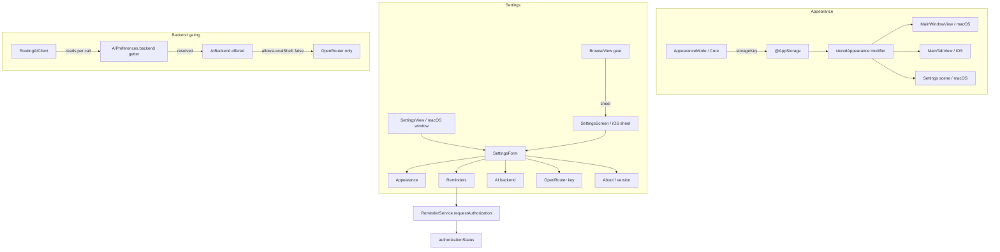

```mermaid
flowchart TD
    subgraph "Settings: one surface"
        A[MainTabView] -->|"4 tabs, no Settings"| B[BrowseView]
        B -->|"ProfileAvatar button"| C[ProfileScreen]
        C --> D[SettingsForm]
        D --> E["profileSection: avatar + name"]
        D --> F[Appearance / Reminders / AI / About]
        E -.->|"@AppStorage"| G["UserProfile.displayNameKey"]
        G -.-> H["UserProfile.initials(from:)"]
        H --> I[ProfileAvatar]
        I --> B
        I --> E
    end

    subgraph "Quick-add: picker + syntax"
        J[QuickAddChip] -->|presentQuickAdd| K["quickAddProjectID = project?.id"]
        K --> L[QuickAddSheet]
        L -->|"parses its own text"| M[NaturalLanguageTaskParser]
        M --> N["TaskDraft: projectName, priority, labels, dueDate"]
        N -->|"projectName ?? picked"| O[project Menu label]
        N -->|"priority, labels, dueDate"| P[preview chips]
        N -->|"dueDate != nil"| Q[Remind me toggle]
        O -->|"choose(project)"| R["strippingProjectTokens"]
        R -->|rewrites| L
        L -->|onSubmit| S["submit(): picked ?? pane project"]
        S --> T["AIService.quickAdd"]
        T --> U["TaskService.create"]
        U -->|"draft.projectName wins"| V["ProjectService.findOrCreate"]
        U -->|else| W[passed project]
    end
```

# 2026-07-25

## Session 1 — Settings, appearance override, and the "two tabs" toolbar

Three asks: *"is there 2 tabs at the top? also, this design looks atrocious. we need
settings page too."* One diagnosis, one visual cleanup pass, one new Settings surface
on iOS plus the appearance preference it exists to host.

### System flow

### Affected components

- **Core** — new `AppearanceMode`; `AIBackend` gained `requiresLocalShell`,
  `offered(allowsLocalShell:)`, `resolved(_:allowsLocalShell:)`; `AIPreferences`
  gained `platformAllowsLocalShell` and a coercing getter.
- **Data** — `ReminderService.requestAuthorization()`.
- **SharedUI** — `AppearanceMode.colorScheme` + `.storedAppearance()`.
- **Features** — new `Settings/` (`SettingsForm`, `SettingsScreen`); `BrowseView`
  and `TaskListContainer` reworked.
- **Platform/macOS** — `SettingsView` reduced to a wrapper; `SidebarView` badges.

### What was done

- [x] Diagnosed the "two tabs" report — not tabs.
- [x] Replaced the segmented layout picker with a single `Menu` toolbar item.
- [x] `AppearanceMode` in Core + `.storedAppearance()` on every window root.
- [x] Shared `SettingsForm`; iOS `SettingsScreen` sheet; macOS window as a wrapper.
- [x] Reminders section in Settings with a standalone authorization request.
- [x] CLI AI backends gated off iOS at the preference layer, not just the UI.
- [x] Browse: utility section first, trailing task counts, glyph-only project colour.
- [x] Tests: `AppearanceModeTests`, `AIBackendTests`, four new `ReminderService` cases.

### Key decisions

- **The "two tabs" were one control.** `TaskListContainer` put a `.segmented` +
  `.labelsHidden()` `Picker` inside `ToolbarItem(.primaryAction)`. iOS 26 gives every
  toolbar item its own glass background, so an icon-only segmented picker renders as
  two mismatched pills under the title that read like unlabelled tabs. Replaced with
  one `Menu` whose inline picker names the layouts in words.
- **iOS backend gating belongs in `AIPreferences`, not Settings.** `RoutingAIClient`
  re-reads `aiPreferences.backend` on every call, so hiding the CLI options in the
  picker would have been cosmetic — a value synced from a Mac would still fail every
  request. The getter now resolves through `AIBackend.resolved`, and one constant
  (`platformAllowsLocalShell`) is read by both the preference and the form.
- **`AppearanceMode` lives in Core.** GUI sources aren't a SwiftPM target and can't be
  unit-tested; the raw values are a stored `UserDefaults` contract, so they belong
  somewhere with tests.
- **`SettingsScreen` lives in `Features/Settings/`, not `Platform/iOS/`.** Its only
  presenter, `BrowseView`, is compiled into both app targets — an iOS-only file would
  break the macOS build. Same reason `.primaryAction` is used over `.topBarTrailing`,
  and `.listStyle(.insetGrouped)` is left unset.
- **Added `ReminderService.requestAuthorization()` rather than reusing
  `synchronize`.** On `notDetermined` the app isn't in the system notification list
  yet, so "enable it in Settings" is wrong advice — Settings has to be able to ask.
- **Project colour tints the glyph only.** Tinting the whole `Label` dyed the project
  name to a washed-out mid-colour; the reference keeps the name at full contrast.
- **No bell next to the gear, no Favorites section.** Nothing sets `Project.isFavorite`
  anywhere, so the section would always be empty (#62), and there's no notification
  inbox for a bell to open.

### Files changed

| File | Change |
|---|---|
| `Sources/Core/Models/AppearanceMode.swift` | new — persisted appearance enum |
| `Sources/Core/AI/AIBackend.swift` | `requiresLocalShell`, `offered`, `resolved`; `AIPreferences` coerces on read |
| `Sources/Data/Services/ReminderService.swift` | `requestAuthorization()` for the Settings entry point |
| `Sources/SharedUI/Theme/Appearance.swift` | new — `colorScheme` bridge + `.storedAppearance()` |
| `Sources/Features/Settings/SettingsForm.swift` | new — the shared form, five sections |
| `Sources/Features/Settings/SettingsScreen.swift` | new — iOS sheet wrapper |
| `Sources/Features/Browse/BrowseView.swift` | gear → Settings sheet, section reorder, badges, glyph-only colour |
| `Sources/Features/TaskList/TaskListContainer.swift` | segmented picker → `Menu` |
| `Sources/Platform/macOS/SettingsView.swift` | 83 lines → 14-line wrapper over `SettingsForm` |
| `Sources/Platform/macOS/SidebarView.swift` | project badges; glyph-only colour |
| `Tests/UnitTests/AppearanceModeTests.swift` | new — stored-contract and presentation cases |
| `Tests/UnitTests/AIBackendTests.swift` | new — offer/resolve matrix + isolated-defaults round trips |
| `Tests/DataTests/ReminderServiceTests.swift` | four cases for standalone authorization |

### Mistakes and fixes

- **A chained stash/rebase/pop broke the tree.** `git stash -u && … git rebase
  origin/master && git stash pop` in one command did two bad things: it replayed the
  already-squash-merged PR #83 commit as a duplicate `5dd7ae8` (whose only surviving
  content was a **duplicate `planDay()` declaration** — a non-compiling tree), and the
  pop conflicted, leaving literal markers in `OpenFocusApp.swift`. Fixed by resolving
  the conflict keeping **both** sides (master's reminders wiring *and*
  `.storedAppearance()`), `git reset --soft c276b55`, and deleting the duplicate
  method by hand. Lesson: don't chain a rebase and a stash pop — the pop's conflict
  state is invisible until the whole command has already run.
- **`#if !os(macOS)` inside a modifier chain.** First draft of the API-key field
  wrapped `.textInputAutocapitalization` / `.autocorrectionDisabled` in a postfix
  `#if`. Deleted both — `SecureField` already opts out of each on iOS.
- **`SettingsScreen` first written under `Platform/iOS/`.** Would have broken the
  macOS build via `BrowseView`. Moved to `Features/Settings/`.

### Follow-up — bundle id unified

The two app targets carried platform suffixes (`dev.openfocus.app.macos`,
`dev.openfocus.app.ios`) while `KeychainService` already defaulted its service name
to `dev.openfocus.app` — so the app's identity in code and its identity in the build
settings disagreed. Both targets are now `dev.openfocus.app`, with a comment on the
macOS one explaining that the match is deliberate: an identical bundle id across
platforms is what makes this a single App Store product (Universal Purchase), lets the
two share an iCloud container when #10 lands, and lets Handoff pair them.

Safe to change here because there are no entitlements files in the repo — no App Group
or iCloud container is keyed to the old ids. The reminder notification prefix
(`dev.openfocus.task-reminder.`) is a hardcoded literal, not derived from the bundle
id, so scheduled reminders are unaffected.

**Consequence to expect on next install:** the simulator's data container is keyed by
bundle id, so the app installs as a *new* app with an empty SwiftData store. Existing
simulator tasks will not appear, and the old `dev.openfocus.app.ios` install lingers as
a separate icon until uninstalled. This is the same shape as the 07-24 "task vanished"
false alarm — it is not a persistence bug.

### Known findings, not fixed here

- Issue #10's **iCloud sync status** section is still open. The notification-
  authorization half of that issue is now done.
- `Project.isFavorite` is declared and initialised but never written anywhere, so
  Todoist's Favorites section can't be built yet (#62).

### Next steps

- Verification runs in PR CI — the local-check restriction stands, nothing was built
  or tested on this machine.
- ~~`#project` / `!!priority` / labels in quick-add: still awaiting Vincent's confirm
  before an issue is filed.~~ **Resolved in Session 2** — built directly, no issue
  filed, and the priority syntax changed to a single `!` plus a digit.

---

## Session 2 — One settings surface, and quick-add gets a project picker

Vincent, with a screenshot of a five-tab bottom bar: *"why do we have both settings in
tabs and in browse? it should be only in browse, with a profile icon page. also, when we
add a task, i want to see a project selector, but able to assign a project with a #
before, and assign priority with ! before 1, 2, 3, etc."*

The duplication was worse than cosmetic. The **tab** rendered a stale
`Platform/iOS/SettingsView.swift` — notifications only, written before Session 1 — while
**Browse's gear** rendered the new `SettingsForm`. Two different screens, both called
Settings, drifting apart.

### System flow

### Affected components

- **Core** — new `UserProfile` (storage key + initials); `NaturalLanguageTaskParser`
  gained `strippingProjectTokens(from:)`; `DateExpressionParser` parses `#project`,
  `@label`, `!1`–`!4`.
- **Data** — `ProjectService.findOrCreate(named:)`; `TaskService` resolves a draft's
  project name through it; `OpenFocusServices` orders the two.
- **SharedUI** — new `ProfileAvatar`.
- **Features** — `SettingsForm` gained a profile section and the iOS `.denied` deep
  link; `SettingsScreen` → `ProfileScreen`; `BrowseView` gear → avatar; `QuickAddSheet`
  rewritten; `TaskListContainer` rewired.
- **Platform/iOS** — Settings tab deleted; stale `SettingsView.swift` deleted.
- **CLIKit** — usage string updated to the new syntax.

### What was done

- [x] Deleted the Settings tab; Browse is the only way in.
- [x] Deleted the stale iOS `SettingsView`, porting its one unique behaviour first.
- [x] `UserProfile` + `ProfileAvatar` + `ProfileScreen`; profile section in `SettingsForm`.
- [x] Parser: `#project` (last wins), `@label`, `!1`–`!4`, `!!` still urgent, `!` high.
- [x] `ProjectService.findOrCreate`; `TaskService.create` resolves `#project` to a row.
- [x] `QuickAddSheet`: project `Menu`, live parse-preview chips, date-aware reminder toggle.
- [x] `TaskListContainer`: seeds the picker from the current pane, resolves it on submit.
- [x] Tests: `UserProfileTests`, `NaturalLanguageTaskParserTests`, `ProjectServiceTests`,
      six new `DateExpressionParser` cases, four new `TaskService` cases.

### Key decisions

- **Delete the stale screen, don't repoint the tab.** Repointing `SettingsView` at
  `SettingsForm` would have fixed the mismatch and left two settings entry points free
  to drift again. With the tab gone there is exactly one, so they *can't*. Its only
  unique behaviour — the `.denied` → `openSettingsURLString` deep link — moved into
  `SettingsForm` behind `#if os(iOS)`, so nothing was lost.
- **The profile is a section of `SettingsForm`, not a wrapper around it.** The first
  sketch extracted a `SettingsSections` view so `ProfileScreen` could put a header above
  it — that nests a `Form` in a `Form`. Making the avatar + name the form's *first*
  section is one file, no nesting. macOS Settings inherits it, which is correct: the
  name is cross-platform.
- **`UserProfile` lives in Core.** Same reasoning as `AppearanceMode` last session: the
  `UserDefaults` key is a persisted contract and `initials(from:)` is real logic, and
  GUI sources aren't a SwiftPM target so nothing there can be tested.
- **A typed `#token` outranks the picker.** `TaskService.create` already resolves
  `draft.projectName` ahead of the passed project, so the sheet's label shows
  `draft.projectName ?? picked` — whichever will actually win. It names an unmatched
  token too, because that token *creates* a project on save and hiding it would be a
  surprise.
- **Picking from the menu strips the typed token.** Otherwise the token wins at save
  time and the picker silently lies about where the task is going. An `onChange`
  re-sync was rejected as clobber-prone; stripping is one direction and mirrors the
  parser's own consume rule, so a bare `#` survives.
- **Explicit `Button`s with a manual checkmark, not a `Picker`.** The selection can
  originate from typed text *or* the menu; a picker's single binding can't represent
  "the text is overriding me".
- **The sheet parses its own text.** It needs the draft for the picker label, the
  preview chips *and* the reminder toggle — re-parsing a short string per keystroke is
  cheaper than threading three derived values through the caller. This is what let
  `reminderAvailable` and `TaskListContainer.quickAddHasDueDate` be deleted.
- **`!5` stays in the title.** `priorityLevel(for:)` returns nil outside 1–4 rather than
  clamping, so an out-of-range level reads as literal text instead of being silently
  reinterpreted. Pinned by a test.
- **Case-insensitive project matching, not diacritic-insensitive.** Folding accents
  would merge "Résumé" and "Resume" — too clever for a personal task app.

### Files changed

| File | Change |
|---|---|
| `Sources/Core/Models/UserProfile.swift` | new — display-name key + `initials(from:)` |
| `Sources/Core/Parsing/NaturalLanguageTaskParser.swift` | `strippingProjectTokens(from:)` |
| `Sources/Core/Parsing/DateExpressionParser.swift` | `#project`, `@label`, `!1`–`!4` |
| `Sources/Data/Services/ProjectService.swift` | `findOrCreate(named:)` |
| `Sources/Data/Services/TaskService.swift` | resolves `draft.projectName` over the passed project |
| `Sources/Data/OpenFocusServices.swift` | `ProjectService` built before `TaskService` |
| `Sources/SharedUI/ProfileAvatar.swift` | new — initials avatar, 28pt and 56pt |
| `Sources/Features/Settings/SettingsForm.swift` | profile section; iOS `.denied` deep link |
| `Sources/Features/Settings/ProfileScreen.swift` | new — replaces `SettingsScreen` |
| `Sources/Features/Settings/SettingsScreen.swift` | **deleted** — superseded |
| `Sources/Features/Browse/BrowseView.swift` | gear → `ProfileAvatar` → `ProfileScreen` |
| `Sources/Features/QuickAdd/QuickAddSheet.swift` | rewritten — project menu + parse preview |
| `Sources/Features/TaskList/TaskListContainer.swift` | picker wiring; icon-only layout menu; new empty-state hint |
| `Sources/Platform/iOS/MainTabView.swift` | Settings tab removed |
| `Sources/Platform/iOS/SettingsView.swift` | **deleted** — stale duplicate |
| `Sources/CLIKit/CommandParser.swift` | usage → `report fri 5pm !1 #work @review` |
| `Tests/UnitTests/UserProfileTests.swift` | new — 7 initials cases |
| `Tests/UnitTests/NaturalLanguageTaskParserTests.swift` | new — 4 stripping cases |
| `Tests/UnitTests/DateExpressionParserTests.swift` | 6 cases for `!`, `!n`, `#`, `@` |
| `Tests/DataTests/ProjectServiceTests.swift` | new — 6 cases incl. `findOrCreate` |
| `Tests/DataTests/TaskServiceTests.swift` | 4 cases for draft project resolution |

### Mistakes and fixes

- **A stale call site left the iOS target non-compiling for a stretch.** `QuickAddSheet`
  was rewritten with a new signature (`projectID:projects:`, no `reminderAvailable:`)
  before `TaskListContainer` was updated to match. Caught by re-reading the call site,
  not by a build — the local-check restriction means signature changes have to be
  chased by hand across every caller in the same pass.
- **"12 AM" in the preview chip.** The first `metadata` draft formatted every parsed
  date with `.hour().minute()`, so a bare "fri" — which parses to midnight — displayed
  a time the user never typed. Extracted `dueDateText`, which only shows the clock when
  hour or minute is non-zero.
- **`UIApplication` in a cross-platform file.** `SettingsForm` compiles on macOS too, so
  the deep link needed `#if os(iOS) import UIKit #endif` rather than relying on SwiftUI
  re-exporting UIKit — the pattern the deleted `Platform/iOS/SettingsView.swift` used.
- **zsh ate an unquoted grep flag.** `grep --include=*.swift` fails with `no matches
  found`; quote it or drop it (`grep -rn -- 'pattern' Sources Tests`).

### Next steps

- Verification runs in PR CI. SwiftLint was the only local check run — clean.
- The `!1`–`!4` scale maps to four `Priority` cases; Vincent's ask said "1, 2, 3, etc.",
  so if a fifth level is ever wanted it needs a `Priority` case first.
- Issue #10's iCloud sync status section is still open (#62's Favorites still blocked on
  nothing writing `Project.isFavorite`).
