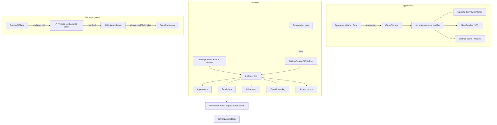

# 2026-07-25

## Session 1 — Settings, appearance override, and the "two tabs" toolbar

Three asks: *"is there 2 tabs at the top? also, this design looks atrocious. we need
settings page too."* One diagnosis, one visual cleanup pass, one new Settings surface
on iOS plus the appearance preference it exists to host.

### System flow

### Affected components

- **Core** — new `AppearanceMode`; `AIBackend` gained `requiresLocalShell`,
  `offered(allowsLocalShell:)`, `resolved(_:allowsLocalShell:)`; `AIPreferences`
  gained `platformAllowsLocalShell` and a coercing getter.
- **Data** — `ReminderService.requestAuthorization()`.
- **SharedUI** — `AppearanceMode.colorScheme` + `.storedAppearance()`.
- **Features** — new `Settings/` (`SettingsForm`, `SettingsScreen`); `BrowseView`
  and `TaskListContainer` reworked.
- **Platform/macOS** — `SettingsView` reduced to a wrapper; `SidebarView` badges.

### What was done

- [x] Diagnosed the "two tabs" report — not tabs.
- [x] Replaced the segmented layout picker with a single `Menu` toolbar item.
- [x] `AppearanceMode` in Core + `.storedAppearance()` on every window root.
- [x] Shared `SettingsForm`; iOS `SettingsScreen` sheet; macOS window as a wrapper.
- [x] Reminders section in Settings with a standalone authorization request.
- [x] CLI AI backends gated off iOS at the preference layer, not just the UI.
- [x] Browse: utility section first, trailing task counts, glyph-only project colour.
- [x] Tests: `AppearanceModeTests`, `AIBackendTests`, four new `ReminderService` cases.

### Key decisions

- **The "two tabs" were one control.** `TaskListContainer` put a `.segmented` +
  `.labelsHidden()` `Picker` inside `ToolbarItem(.primaryAction)`. iOS 26 gives every
  toolbar item its own glass background, so an icon-only segmented picker renders as
  two mismatched pills under the title that read like unlabelled tabs. Replaced with
  one `Menu` whose inline picker names the layouts in words.
- **iOS backend gating belongs in `AIPreferences`, not Settings.** `RoutingAIClient`
  re-reads `aiPreferences.backend` on every call, so hiding the CLI options in the
  picker would have been cosmetic — a value synced from a Mac would still fail every
  request. The getter now resolves through `AIBackend.resolved`, and one constant
  (`platformAllowsLocalShell`) is read by both the preference and the form.
- **`AppearanceMode` lives in Core.** GUI sources aren't a SwiftPM target and can't be
  unit-tested; the raw values are a stored `UserDefaults` contract, so they belong
  somewhere with tests.
- **`SettingsScreen` lives in `Features/Settings/`, not `Platform/iOS/`.** Its only
  presenter, `BrowseView`, is compiled into both app targets — an iOS-only file would
  break the macOS build. Same reason `.primaryAction` is used over `.topBarTrailing`,
  and `.listStyle(.insetGrouped)` is left unset.
- **Added `ReminderService.requestAuthorization()` rather than reusing
  `synchronize`.** On `notDetermined` the app isn't in the system notification list
  yet, so "enable it in Settings" is wrong advice — Settings has to be able to ask.
- **Project colour tints the glyph only.** Tinting the whole `Label` dyed the project
  name to a washed-out mid-colour; the reference keeps the name at full contrast.
- **No bell next to the gear, no Favorites section.** Nothing sets `Project.isFavorite`
  anywhere, so the section would always be empty (#62), and there's no notification
  inbox for a bell to open.

### Files changed

| File | Change |
|---|---|
| `Sources/Core/Models/AppearanceMode.swift` | new — persisted appearance enum |
| `Sources/Core/AI/AIBackend.swift` | `requiresLocalShell`, `offered`, `resolved`; `AIPreferences` coerces on read |
| `Sources/Data/Services/ReminderService.swift` | `requestAuthorization()` for the Settings entry point |
| `Sources/SharedUI/Theme/Appearance.swift` | new — `colorScheme` bridge + `.storedAppearance()` |
| `Sources/Features/Settings/SettingsForm.swift` | new — the shared form, five sections |
| `Sources/Features/Settings/SettingsScreen.swift` | new — iOS sheet wrapper |
| `Sources/Features/Browse/BrowseView.swift` | gear → Settings sheet, section reorder, badges, glyph-only colour |
| `Sources/Features/TaskList/TaskListContainer.swift` | segmented picker → `Menu` |
| `Sources/Platform/macOS/SettingsView.swift` | 83 lines → 14-line wrapper over `SettingsForm` |
| `Sources/Platform/macOS/SidebarView.swift` | project badges; glyph-only colour |
| `Tests/UnitTests/AppearanceModeTests.swift` | new — stored-contract and presentation cases |
| `Tests/UnitTests/AIBackendTests.swift` | new — offer/resolve matrix + isolated-defaults round trips |
| `Tests/DataTests/ReminderServiceTests.swift` | four cases for standalone authorization |

### Mistakes and fixes

- **A chained stash/rebase/pop broke the tree.** `git stash -u && … git rebase
  origin/master && git stash pop` in one command did two bad things: it replayed the
  already-squash-merged PR #83 commit as a duplicate `5dd7ae8` (whose only surviving
  content was a **duplicate `planDay()` declaration** — a non-compiling tree), and the
  pop conflicted, leaving literal markers in `OpenFocusApp.swift`. Fixed by resolving
  the conflict keeping **both** sides (master's reminders wiring *and*
  `.storedAppearance()`), `git reset --soft c276b55`, and deleting the duplicate
  method by hand. Lesson: don't chain a rebase and a stash pop — the pop's conflict
  state is invisible until the whole command has already run.
- **`#if !os(macOS)` inside a modifier chain.** First draft of the API-key field
  wrapped `.textInputAutocapitalization` / `.autocorrectionDisabled` in a postfix
  `#if`. Deleted both — `SecureField` already opts out of each on iOS.
- **`SettingsScreen` first written under `Platform/iOS/`.** Would have broken the
  macOS build via `BrowseView`. Moved to `Features/Settings/`.

### Follow-up — bundle id unified

The two app targets carried platform suffixes (`dev.openfocus.app.macos`,
`dev.openfocus.app.ios`) while `KeychainService` already defaulted its service name
to `dev.openfocus.app` — so the app's identity in code and its identity in the build
settings disagreed. Both targets are now `dev.openfocus.app`, with a comment on the
macOS one explaining that the match is deliberate: an identical bundle id across
platforms is what makes this a single App Store product (Universal Purchase), lets the
two share an iCloud container when #10 lands, and lets Handoff pair them.

Safe to change here because there are no entitlements files in the repo — no App Group
or iCloud container is keyed to the old ids. The reminder notification prefix
(`dev.openfocus.task-reminder.`) is a hardcoded literal, not derived from the bundle
id, so scheduled reminders are unaffected.

**Consequence to expect on next install:** the simulator's data container is keyed by
bundle id, so the app installs as a *new* app with an empty SwiftData store. Existing
simulator tasks will not appear, and the old `dev.openfocus.app.ios` install lingers as
a separate icon until uninstalled. This is the same shape as the 07-24 "task vanished"
false alarm — it is not a persistence bug.

### Known findings, not fixed here

- Issue #10's **iCloud sync status** section is still open. The notification-
  authorization half of that issue is now done.
- `Project.isFavorite` is declared and initialised but never written anywhere, so
  Todoist's Favorites section can't be built yet (#62).

### Next steps

- Verification runs in PR CI — the local-check restriction stands, nothing was built
  or tested on this machine.
- `#project` / `!!priority` / labels in quick-add: still awaiting Vincent's confirm
  before an issue is filed.
